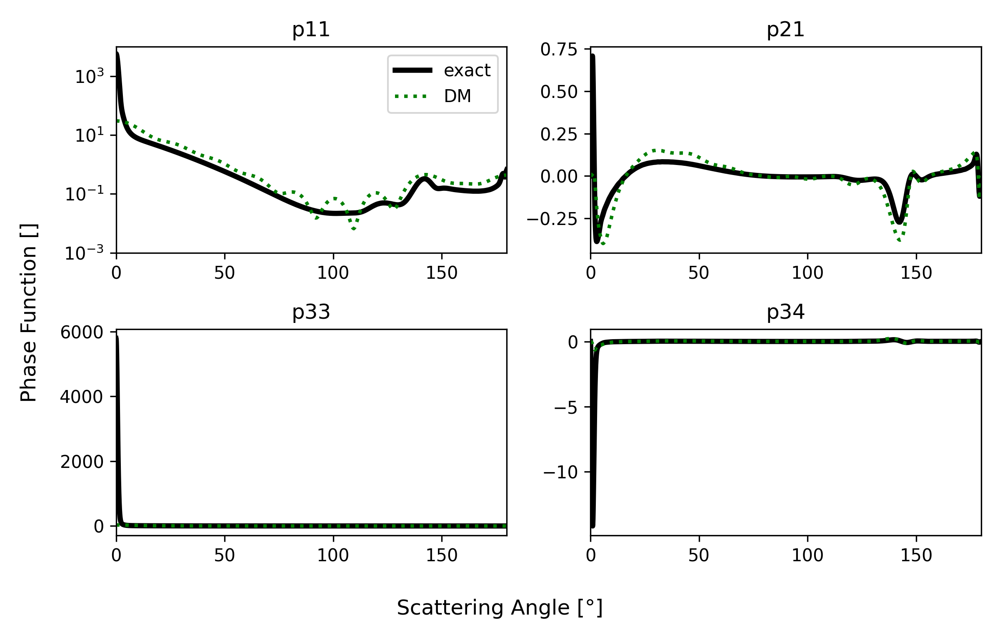
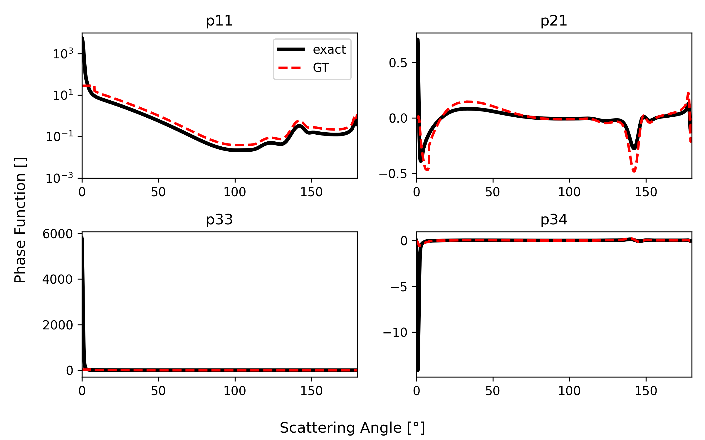

# pytrunc
Scattering phase matrix truncation Python tool for radiative transfer applications.


## Installation

For an installation via pip, you can use the following command:

```bash
pip install git+https://github.com/hygeos/pytrunc.git
```

## Examples

Example using the Delta-m method:

<details>
<summary>Voir l'image</summary>

```python
>>> ...
>>> from pytrunc.truncation import delta_m_phase_approx
>>> m_max = 20 # stream / term number
>>> # phase_exact -> P11 of a liquid cloud at 500nm and an effective radius of 8 mirometers
>>> # theta -> the phase angles in degrees
>>> ds = delta_m_phase_approx(phase_exact, theta, m_max) # return an xarray dataset
>>> ...
```



</details>

Example using the Geometric Truncation:

<details>
<summary>Voir l'image</summary>

```python
>>> ...
>>> from pytrunc.truncation import delta_m_phase_approx
>>> from pytrunc.phase import calc_moments
>>> m_max = 20 # stream / term number
>>> # phase_exact -> P11 of a liquid cloud at 500nm and an effective radius of 8 mirometers
>>> # theta -> the phase angles in degrees
>>> chi = calc_moments(phase_exact, theta, m_max=m_max, normalize=True) # the phase moments
>>> f = chi[m_max] # The truncation factor
>>> ds = delta_m_phase_approx(phase_exact, theta, f) # return an xarray dataset
>>> ...
```



</details>